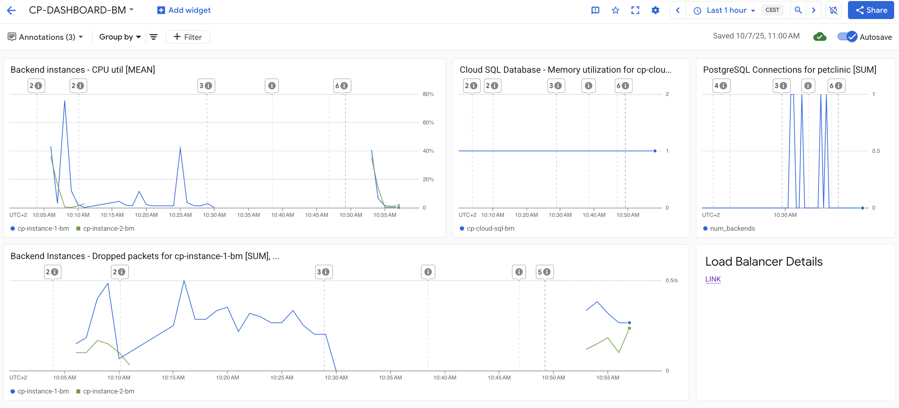

# Monitoring for Capstone Project

This dashboard was created in **GCP Monitoring** to provide observability for key elements of the infrastructure:

- CPU utilization of backend instances
- Dropped packets on backend instances
- Cloud SQL memory utilization
- Database connections
- Link to the Load Balancer resource for detailed information, including health checks

## Dashboard View

  

**Dashboard Name:** `CP-DASHBOARD-BM`
